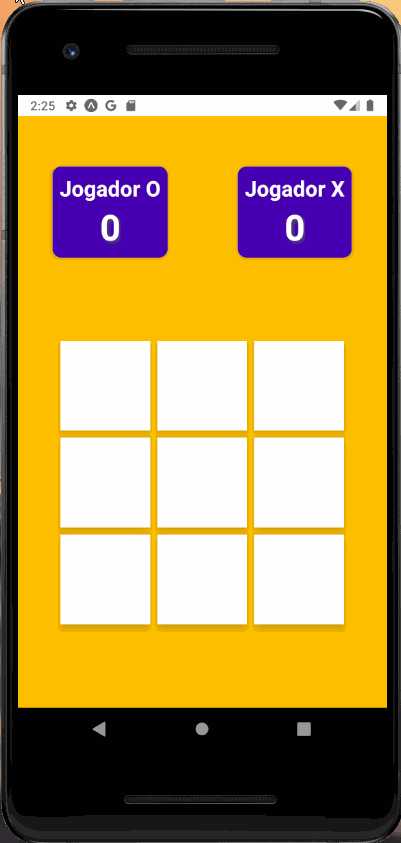
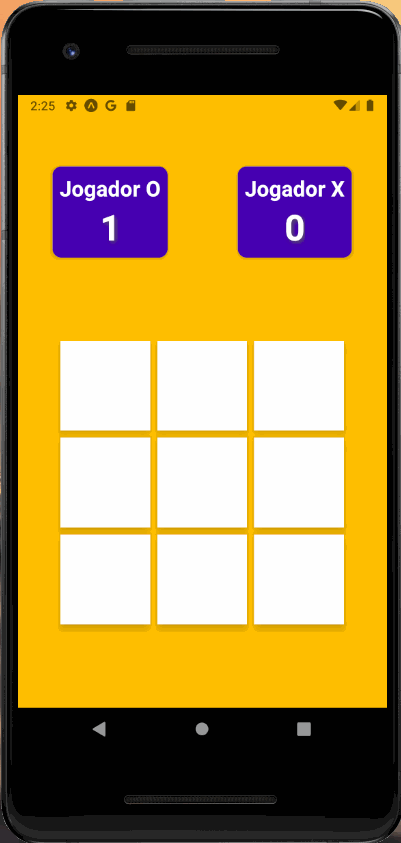
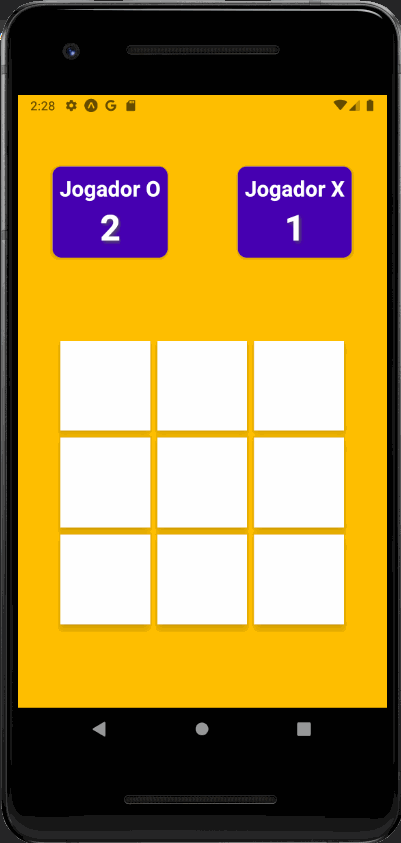

<h1 align="center">📱 TicTacToe - Mobile</h1>
<h4 align="center" style="margin-bottom:30px"> 
	🚧  Projeto 🚀 Em construção...  🚧
</h4>

 <a href="#objetivo">Objetivo</a> •
 <a href="#tecnologias">Tecnologias</a> •
 <a href="#image">Prototipo Atual</a> • 
 <a href="https://github.com/leouluz">Autor-Leonardo</a>

  <h1 align="center">🚀 Objetivo do Projeto</h1>
  
 Meu objetivo com este projeto é colocar em pratica meu conhecimento em React-native.

  <h1 align="center" >⚡️ Tecnologias</h1>
  
 Estou trabalhando com React-Native, Expo e Lottie para animações. 

  
Acesse a documentação abaixo:

  

    <a href="https://reactnative.dev/">React-native</a>
  

  

    <a href="https://docs.expo.io/">Expo</a>
  

  

    <a href="https://docs.expo.io/versions/latest/sdk/lottie/">Lottie</a>
  

  <h1 align="center">✨ Indetidade do projeto atualmente</h1>
  

    
    
    
  

